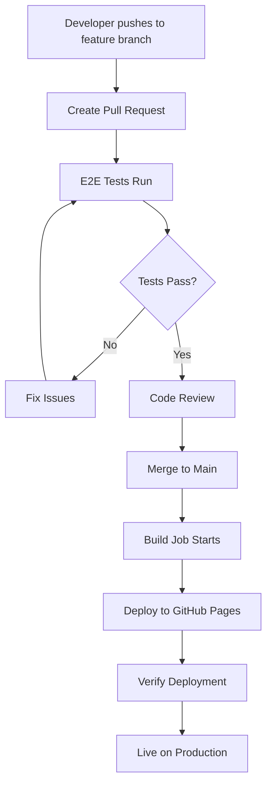

# MarkVim Deployment Setup

## Overview

MarkVim uses an automated deployment pipeline built with GitHub Actions that deploys to GitHub Pages. The deployment process is triggered automatically when code is merged to the `main` branch, ensuring a streamlined path from development to production.

## Architecture

```
┌─────────────────┐    ┌──────────────────┐    ┌─────────────────────┐
│   Feature PR    │───▶│   Main Branch    │───▶│   GitHub Pages      │
│                 │    │                  │    │                     │
│ - E2E Tests ✅   │    │ - Auto Deploy 🚀 │    │ - Live Site 🌐      │
│ - Code Review   │    │ - Build & Cache  │    │ - Health Check ✅    │
│ - Status Checks │    │ - Verification   │    │ - Status Reports    │
└─────────────────┘    └──────────────────┘    └─────────────────────┘
```

## Deployment Workflow

### 1. GitHub Actions Workflows

#### E2E Testing (`.github/workflows/e2e.yml`)
- **Triggers**: Push to `main`/`develop`, PRs to `main`
- **Purpose**: Validates code quality before deployment
- **Features**:
  - Caches dependencies and build artifacts
  - Runs Playwright E2E tests
  - Publishes test results with annotations
  - Generates job summaries

#### Deployment (`.github/workflows/deploy.yml`)
- **Triggers**: Push to `main`, manual workflow dispatch
- **Purpose**: Builds and deploys to GitHub Pages
- **Jobs**:
  1. **Build**: Compiles Nuxt app with GitHub Pages preset
  2. **Deploy**: Publishes to GitHub Pages
  3. **Verify**: Health checks post-deployment

### 2. Deployment Process Flow



## Configuration

### Environment Variables
- `NUXT_APP_BASE_URL=/MarkVim/` - Sets base URL for GitHub Pages deployment

### Build Configuration
- **Preset**: `github_pages` - Optimizes build for static hosting
- **Output**: `.output/public` - Static files for deployment
- **Caching**: Dependencies and build artifacts cached for performance

### GitHub Pages Settings
- **Source**: GitHub Actions
- **Domain**: `https://alexanderopalic.github.io/MarkVim/`
- **Permissions**: Pages write, ID token write

## Key Features

### 🚀 **Automated Deployment**
- Zero-downtime deployments
- Automatic triggering on main branch updates
- No manual intervention required

### ⚡ **Performance Optimizations**
- **Dependency Caching**: Reuses `node_modules` between runs
- **Build Caching**: Skips rebuild if source unchanged
- **Playwright Browser Caching**: Faster test execution
- **Parallel Processing**: Build and lint run concurrently

### 🔍 **Quality Assurance**
- **Pre-deployment Testing**: E2E tests must pass
- **Post-deployment Verification**: Health checks ensure site is live
- **Status Reporting**: Clear summaries and annotations
- **Artifact Upload**: Test reports preserved on failure

### 📊 **Monitoring & Reporting**
- **Job Summaries**: Detailed deployment information
- **Test Result Annotations**: PR comments with test status
- **Health Check Verification**: Confirms site accessibility
- **Deployment Timestamps**: Track deployment history

## Usage Guide

### Standard Workflow

1. **Create Feature Branch**
   ```bash
   git checkout -b feature/your-feature-name
   # Make your changes
   git commit -m "feat: add new feature"
   git push origin feature/your-feature-name
   ```

2. **Open Pull Request**
   - Create PR targeting `main` branch
   - E2E tests will run automatically
   - Wait for green status ✅

3. **Code Review Process**
   - Team reviews code changes
   - Address any feedback
   - Ensure all status checks pass

4. **Merge to Production**
   - Use "Squash and merge" (recommended)
   - Deployment triggers automatically
   - Monitor GitHub Actions for deployment status

### Manual Deployment

For emergency deployments or testing:

```bash
# Trigger deployment manually via GitHub Actions UI
# Go to: Actions → Deploy to GitHub Pages → Run workflow
```

### Local Preview

Test the production build locally:

```bash
# Build for production
NUXT_APP_BASE_URL=/MarkVim/ pnpm run build --preset github_pages

# Preview the build
pnpm preview
```

## Troubleshooting

### Common Issues

#### Deployment Fails
1. Check GitHub Actions logs
2. Verify build passes locally
3. Ensure all dependencies are in `package.json`

#### Site Not Accessible After Deployment
1. Wait 5-10 minutes for GitHub Pages propagation
2. Check if GitHub Pages is enabled in repository settings
3. Verify the verification job status

#### E2E Tests Failing
1. Run tests locally: `pnpm run test:e2e:headed`
2. Check if UI changes broke test selectors
3. Update page objects if needed

#### Cache Issues
If builds are using stale cache:
```bash
# Clear GitHub Actions caches in repository settings
# Or update cache keys in workflow files
```

### Debugging Commands

```bash
# Run E2E tests locally
pnpm run test:e2e

# Run with headed browser for debugging
pnpm run test:e2e:headed

# Build and preview production locally
pnpm run build --preset github_pages
pnpm preview

# Check linting issues
pnpm lint
```

## Best Practices

### Branch Management
- Always create feature branches from `main`
- Use descriptive branch names (`feat/`, `fix/`, `docs/`)
- Keep PRs focused and atomic
- Delete feature branches after merging

### Code Quality
- Ensure E2E tests pass before merging
- Write tests for new features
- Follow the established code style
- Use meaningful commit messages

### Deployment Safety
- Never push directly to `main`
- Always use PRs for code changes
- Monitor deployment status after merging
- Keep `main` branch stable and deployable

### Performance
- Keep bundle size optimized
- Use proper image optimization
- Leverage caching strategies
- Monitor build times

## Monitoring

### Key Metrics to Watch
- **Deployment Success Rate**: Target 99%+
- **Build Time**: Monitor for increases
- **Test Execution Time**: Keep under 5 minutes
- **Site Availability**: 99.9% uptime target

### Health Checks
- Automated site accessibility verification
- Response time monitoring
- Error rate tracking

## Security

### Permissions
- **Minimal Required Permissions**: Only pages write and ID token
- **Environment Isolation**: Production environment protection
- **Secret Management**: No secrets required for current setup

### Branch Protection
Recommended repository settings:
- Require status checks before merging
- Require up-to-date branches before merging
- Require review from code owners
- Restrict pushes to main branch

## Future Improvements

### Potential Enhancements
- **Staging Environment**: Deploy PRs to preview URLs
- **Performance Monitoring**: Lighthouse CI integration
- **Rollback Capability**: Quick revert mechanisms
- **Multi-environment Support**: Development/staging/production
- **Notification System**: Slack/Discord deployment notifications
- **Advanced Caching**: CDN integration for better global performance

### Monitoring Upgrades
- **Real User Monitoring**: Track actual user experience
- **Error Tracking**: Automatic error reporting
- **Analytics Integration**: Usage and performance metrics
- **Automated Testing**: Additional test coverage

## Support

For deployment issues:
1. Check GitHub Actions logs
2. Review this documentation
3. Consult team members
4. Create issue if problem persists

---

**Last Updated**: $(date)  
**Maintained By**: MarkVim Development Team 