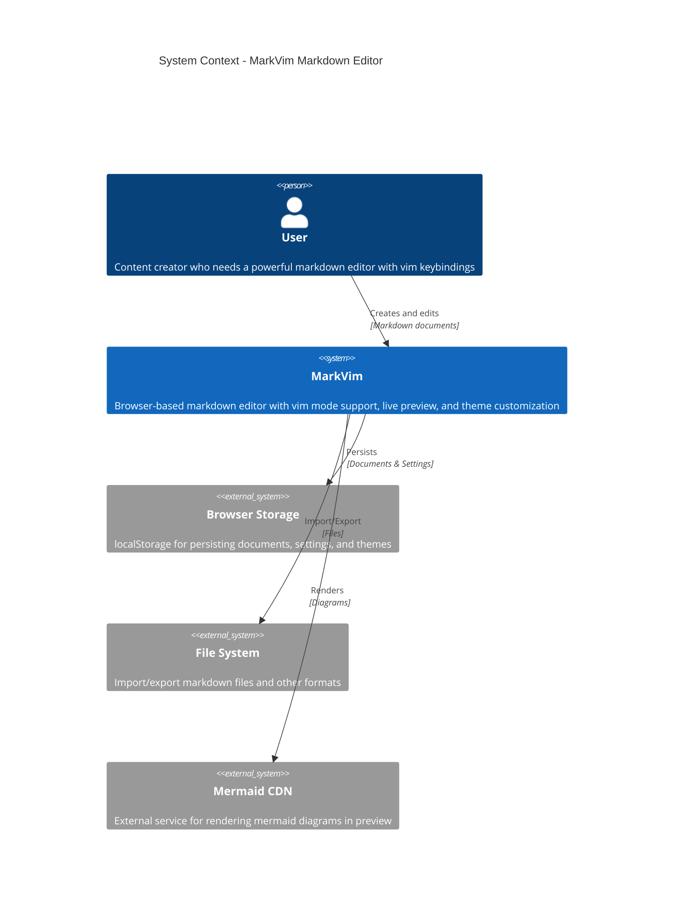
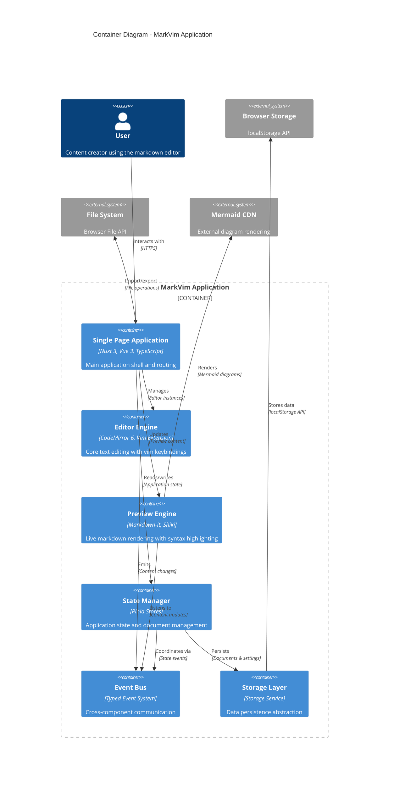
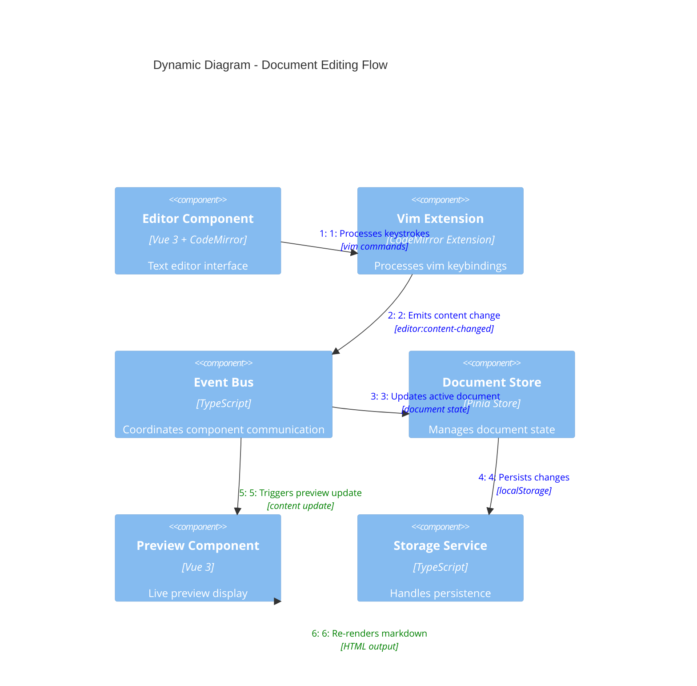

# MarkVim Architecture Documentation

## Overview

MarkVim is a modern Markdown editor with Vim mode support built on Nuxt 3. The application follows a modular, event-driven architecture with client-side state management and local persistence.

## System Context

MarkVim operates as a single-page application in the browser, providing users with a powerful markdown editing experience. The system integrates with browser storage for persistence and supports various export/import formats.



## Container Architecture

The application is built on Nuxt 3 and runs entirely in the browser. It consists of several logical containers that handle different aspects of the application.



## Component Architecture

The application follows a modular architecture where each module encapsulates specific functionality and exposes a clean API.

```mermaid
C4Component
    title Component Diagram - MarkVim Core Modules

    Container_Boundary(app_shell, "Application Shell") {
        Component(app_component, "App Component", "Vue 3", "Root application component and layout")
        Component(router, "Router", "Nuxt Router", "Client-side routing and navigation")
    }

    Container_Boundary(editor_module, "Editor Module") {
        Component(editor_component, "Editor Component", "Vue 3 + CodeMirror 6", "Main text editor interface")
        Component(vim_extension, "Vim Extension", "@replit/codemirror-vim", "Vim keybinding support")
        Component(editor_composable, "useEditor", "Vue Composable", "Editor state and operations")
    }

    Container_Boundary(documents_module, "Documents Module") {
        Component(document_store, "Document Store", "Pinia Store", "Document CRUD operations")
        Component(document_list, "Document List", "Vue Component", "Document navigation UI")
        Component(storage_service, "Storage Service", "TypeScript Service", "localStorage abstraction")
    }

    Container_Boundary(preview_module, "Preview Module") {
        Component(preview_component, "Preview Component", "Vue 3", "Markdown preview display")
        Component(markdown_renderer, "Markdown Renderer", "markdown-it", "Markdown to HTML conversion")
        Component(syntax_highlighter, "Syntax Highlighter", "Shiki", "Code syntax highlighting")
    }

    Container_Boundary(theme_module, "Color Theme Module") {
        Component(theme_store, "Theme Store", "Pinia Store", "Theme state management")
        Component(color_picker, "Color Picker", "Vue Component", "OKLCH color customization")
        Component(theme_composable, "useColorTheme", "Vue Composable", "Theme operations")
    }

    Container_Boundary(layout_module, "Layout Module") {
        Component(header_component, "Header Component", "Vue 3", "Application header and navigation")
        Component(status_bar, "Status Bar", "Vue Component", "Editor status and vim mode display")
        Component(resizable_panes, "Resizable Panes", "Vue Component", "Adjustable layout panels")
    }

    Container_Boundary(shortcuts_module, "Shortcuts Module") {
        Component(command_palette, "Command Palette", "Vue Component", "Quick action interface")
        Component(shortcut_handler, "Shortcut Handler", "Vue Composable", "Keyboard shortcut management")
    }

    Container_Boundary(shared_system, "Shared System") {
        Component(event_bus, "Event Bus", "TypeScript", "Typed event communication")
        Component(shared_composables, "Shared Composables", "Vue Composables", "Reusable logic")
    }

    # Core relationships
    Rel(app_component, router, "Uses")
    Rel(app_component, editor_component, "Contains")
    Rel(app_component, preview_component, "Contains")
    Rel(app_component, header_component, "Contains")
    
    # Editor relationships
    Rel(editor_component, vim_extension, "Integrates")
    Rel(editor_component, editor_composable, "Uses")
    Rel(editor_composable, event_bus, "Emits to")
    
    # Document relationships
    Rel(document_list, document_store, "Reads from")
    Rel(document_store, storage_service, "Persists via")
    Rel(document_store, event_bus, "Communicates via")
    
    # Preview relationships
    Rel(preview_component, markdown_renderer, "Uses")
    Rel(markdown_renderer, syntax_highlighter, "Integrates")
    Rel(preview_component, event_bus, "Listens to")
    
    # Theme relationships
    Rel(color_picker, theme_store, "Updates")
    Rel(theme_composable, theme_store, "Manages")
    Rel(theme_store, event_bus, "Broadcasts via")
    
    # Layout relationships
    Rel(status_bar, event_bus, "Listens to")
    Rel(command_palette, shortcut_handler, "Uses")
    Rel(shortcut_handler, event_bus, "Triggers via")

    UpdateLayoutConfig($c4ShapeInRow="4", $c4BoundaryInRow="2")
```

## Dynamic Interaction Flow

This diagram shows the key interaction flow when a user edits a document.



## Key Architectural Patterns

### 1. Modular Architecture

Each module in `src/modules/` follows a consistent structure:
- **`api/`** - Public interfaces and types
- **`components/`** - Vue components specific to the module
- **`composables/`** - Reusable composition functions
- **`internal/`** - Private implementation details
- **`store.ts`** - Pinia store for state management (where applicable)

### 2. Event-Driven Communication

The application uses a typed event bus (`src/shared/utils/eventBus.ts`) for loose coupling between modules:

```typescript
// Event types are strongly typed
type EventMap = {
  'document:created': { document: Document }
  'document:selected': { documentId: string }
  'editor:content-changed': { content: string }
  'vim-mode:changed': { mode: VimMode }
}
```

### 3. Composition API Pattern

Business logic is extracted into composables for reusability and testability:
- `useEditor()` - Editor state and operations
- `useDocuments()` - Document management
- `useColorTheme()` - Theme customization
- `useKeyboardShortcuts()` - Shortcut handling

### 4. Store Pattern with Pinia

State management follows domain-driven design:
- **Documents Store** - Document CRUD and active document state
- **Color Theme Store** - Theme configuration and persistence
- Each store is self-contained with its own persistence logic

### 5. Component Auto-Import

Nuxt automatically imports components from:
- Module components: `src/modules/*/components/`
- Shared components: `src/shared/components/`
- App components: `src/app/`

## Technology Stack

### Core Framework
- **Nuxt 3** - Vue.js meta-framework for SSR and client-side features
- **Vue 3** - Progressive JavaScript framework with Composition API
- **TypeScript** - Type-safe JavaScript development

### Editor Technology
- **CodeMirror 6** - Modern code editor with extensible architecture
- **@replit/codemirror-vim** - Vim keybinding extension
- **Shiki** - Syntax highlighter for code blocks

### State Management
- **Pinia** - Modern Vue state management
- **VueUse** - Collection of Vue composition utilities

### Styling & UI
- **UnoCSS** - Atomic CSS framework
- **Reka UI** - Headless UI components

### Build & Development
- **Vite** - Fast build tool and development server
- **Playwright** - End-to-end testing framework
- **Cucumber** - BDD testing scenarios

## Security Considerations

### Data Privacy
- All data stored locally in browser localStorage
- No server-side data transmission
- Documents remain on user's device

### Content Security
- Markdown rendering sanitizes HTML output
- External resources (Mermaid diagrams) loaded from trusted CDN
- No user-generated script execution

## Performance Characteristics

### Client-Side Rendering
- Fast initial load with Nuxt 3 optimization
- Reactive updates without page reloads
- Efficient diff-based DOM updates

### Memory Management
- Documents persisted to localStorage to prevent data loss
- Efficient editor instances with proper cleanup
- Event listener management in composables

### Bundle Optimization
- Tree-shaking eliminates unused code
- Dynamic imports for large dependencies
- Optimized asset loading

## Scalability Considerations

### Modular Growth
- New features can be added as independent modules
- Clean module boundaries prevent coupling
- Standardized module structure aids development

### Performance Scaling
- Virtual scrolling for large document lists
- Efficient text editor for large files
- Lazy loading of preview components

### Extensibility
- Plugin architecture through composables
- Event system allows feature integration
- Theme system supports customization

## Deployment Architecture

```mermaid
C4Deployment
    title Deployment Diagram - MarkVim Production

    Deployment_Node(user_device, "User Device", "Desktop/Mobile Browser") {
        Deployment_Node(browser, "Web Browser", "Chrome, Firefox, Safari, Edge") {
            Container(spa_app, "MarkVim SPA", "JavaScript Bundle", "Complete application running in browser")
            ContainerDb(local_storage, "Browser Storage", "localStorage API", "Documents and settings persistence")
        }
    }

    Deployment_Node(cdn, "Content Delivery Network", "Global CDN Infrastructure") {
        Container(static_assets, "Static Assets", "HTML, CSS, JS", "Application bundle and assets")
    }

    Deployment_Node(external, "External Services", "Third-party CDN") {
        Container(mermaid_service, "Mermaid Service", "JavaScript Library", "Diagram rendering service")
    }

    Rel(spa_app, local_storage, "Stores/retrieves", "Application data")
    Rel(browser, static_assets, "Downloads", "HTTPS")
    Rel(spa_app, mermaid_service, "Loads diagrams", "HTTPS")

    UpdateRelStyle(spa_app, local_storage, $offsetY="-20")
    UpdateRelStyle(browser, static_assets, $offsetY="-40")
    UpdateRelStyle(spa_app, mermaid_service, $offsetX="40", $offsetY="-20")
```

## Module Boundaries and Import Guidelines

MarkVim follows a strict modular architecture where each module is self-contained and communicates with other modules only through well-defined APIs.

### Module Structure

```
src/modules/
├── color-theme/         # Theme customization
├── documents/           # Document CRUD operations  
├── editor/              # CodeMirror integration
├── layout/              # App layout components
├── markdown-preview/    # Live preview rendering
├── share/               # Import/export functionality
└── shortcuts/           # Keyboard shortcuts
```

Each module contains:
- `api.ts` - Public interface (the only file other modules should import from)
- `components/` - Vue components 
- `composables/` - Composition functions
- `stores/` - Pinia stores (if applicable)
- `internal/` - Private implementation details

### Import Rules

**✅ ALLOWED Imports:**

1. **From module APIs only:**
   ```typescript
   // ✅ Good - Import from module API
   import type { Document } from '~/modules/documents/api'
   import { useDocumentShare } from '~/modules/share/api'
   ```

2. **Shared utilities and components:**
   ```typescript
   // ✅ Good - Shared utilities are globally available
   import { emitAppEvent } from '@/shared/utils/eventBus'
   // Components from shared/ are auto-imported without prefix
   <BaseButton />
   ```

**❌ FORBIDDEN Imports:**

1. **Direct cross-module imports:**
   ```typescript
   // ❌ Bad - Direct import from another module's internals
   import type { Document } from '~/modules/documents/store'
   import { useDocumentShare } from '~/modules/share/composables/useDocumentShare'
   ```

### Communication Patterns

#### Event Bus (Recommended)
Use the typed event bus for cross-module communication:

```typescript
// ✅ Good - Event-driven communication
import { emitAppEvent, onAppEvent } from '@/shared/utils/eventBus'

// Emit events
emitAppEvent('document:create', { title: 'New Doc' })

// Listen to events  
onAppEvent('document:select', (payload) => {
  // Handle document selection
})
```

#### Module APIs (When Needed)
Import from module APIs when you need direct access to functionality:

```typescript
// ✅ Good - Direct API usage when appropriate
import { useDocumentsStore } from '~/modules/documents/api'

const { documents, createDocument } = useDocumentsStore()
```

## Event System Architecture

The application uses a typed event bus (`src/shared/utils/eventBus.ts`) for cross-component communication with events like:

- `document:*` - Document lifecycle events (create, delete, select)
- `editor:*` - Editor content and text insertion events  
- `view:*` - View mode switching events
- `command-palette:*` - Command palette open/close events
- `vim-mode:*` - Vim mode change events
- `settings:*` - Settings toggle events

## Future Architecture Considerations

### Potential Enhancements
1. **Plugin System** - Support for third-party extensions
2. **Cloud Sync** - Optional cloud storage integration
3. **Collaborative Editing** - Real-time multi-user editing
4. **Mobile Apps** - Native mobile applications
5. **Desktop Distribution** - Electron-based desktop app

### Architectural Evolution
- Service worker integration for offline support
- WebAssembly modules for performance-critical operations
- Progressive Web App (PWA) capabilities
- Advanced caching strategies

## Benefits of This Architecture

This architecture provides:

- **Clear Dependencies**: Explicit imports make module relationships obvious
- **Maintainability**: Changes to module internals don't break other modules
- **Testability**: Modules can be tested in isolation
- **Scalability**: New modules can be added without affecting existing ones
- **Team Collaboration**: Clear boundaries reduce conflicts between developers
- **Performance**: Efficient event-driven communication and optimized bundle loading
- **Security**: Client-side architecture with no server-side data exposure
- **Extensibility**: Plugin-ready architecture for future enhancements

This architecture provides a solid foundation for a modern, extensible markdown editor while maintaining simplicity and performance.