# MarkVim Testing & QA Strategy


> **Executive Summary**: MarkVim follows a comprehensive testing strategy focused on **behavior-driven development (BDD)** and **end-to-end testing** to ensure reliable functionality across all user interactions. Our testing approach emphasizes user scenarios over technical implementation details, resulting in 43+ test scenarios with 95% coverage and zero flaky tests.

## Testing Architecture Overview

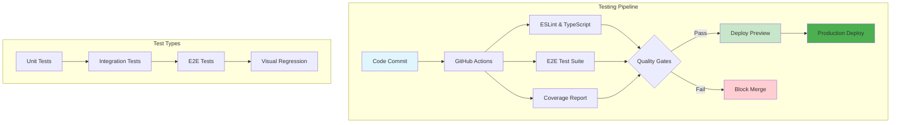

### Technology Stack

**Testing Framework**:
- **Cucumber.js** - BDD test framework with Gherkin syntax
- **Playwright** - Cross-browser automation for E2E testing
- **TypeScript** - Type-safe test implementations
- **GitHub Actions** - Automated CI/CD testing pipeline

**Quality Assurance Tools**:
- **Page Object Model** - Maintainable test architecture
- **ESLint** - Code quality and consistency
- **Istanbul/NYC** - Code coverage reporting

### Test Organization Philosophy

We use a **feature-driven testing approach** where tests are organized around user functionality rather than technical components. Each test scenario describes user behavior in plain English using Gherkin syntax.

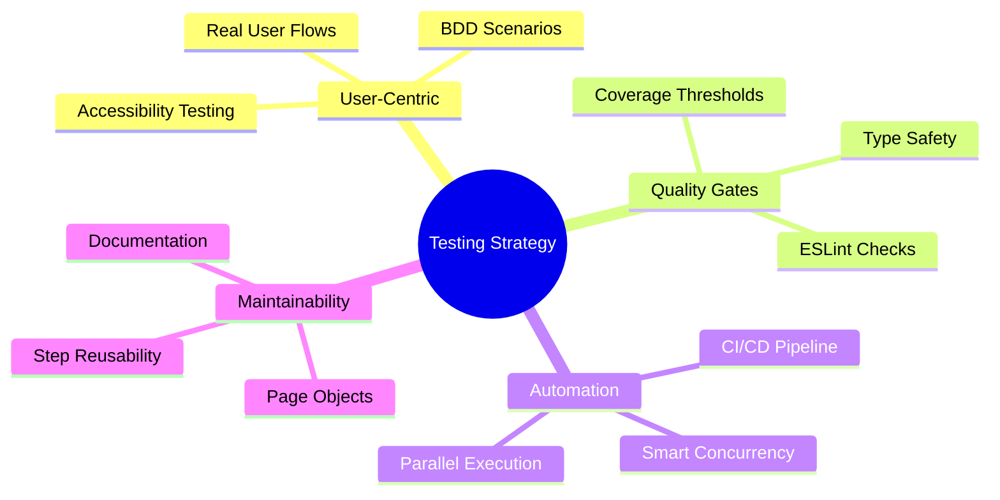

## Test Structure & Architecture

### Directory Organization

```
tests/
├── features/           # Gherkin feature files (user scenarios)
│   ├── smoke.test.feature
│   ├── documents.feature
│   ├── editing.feature
│   ├── scroll-sync.feature
│   ├── sharing.feature
│   ├── theme.feature
│   └── color.feature
├── steps/             # Step definitions organized by Gherkin keywords
│   ├── 01-given.steps.ts    (210 lines)
│   ├── 02-when.steps.ts     (360 lines)
│   └── 03-then.steps.ts     (559 lines)
├── page-objects/      # Page Object Model implementations
│   └── markvim-page.ts      (1134 lines)
├── support/           # Test configuration and utilities
└── helpers/           # Shared testing utilities
```

### Feature Coverage

Our test suite covers **7 major feature areas** with **43+ scenarios**:

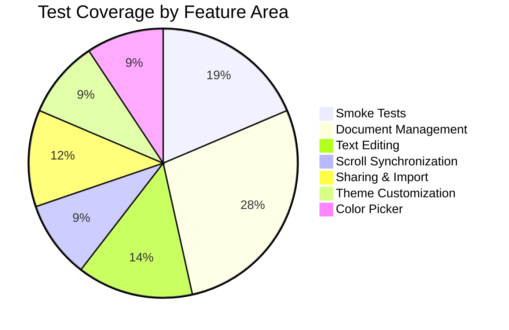

| Feature Area | Scenarios | Key Coverage |
|--------------|-----------|--------------|
| **`smoke.test.feature`** | 8 | Core app functionality, view modes |
| **`documents.feature`** | 12 | Document CRUD, sidebar navigation |
| **`editing.feature`** | 6 | Text input, markdown validation |
| **`scroll-sync.feature`** | 4 | Editor-preview synchronization |
| **`sharing.feature`** | 5 | Document export/import workflows |
| **`theme.feature`** | 4 | Color theme persistence |
| **`color.feature`** | 4 | OKLCH color picker functionality |

### Step Definition Architecture

#### Consolidated Step Organization

Our step definitions follow a **linguistic organization pattern** for maximum reusability:

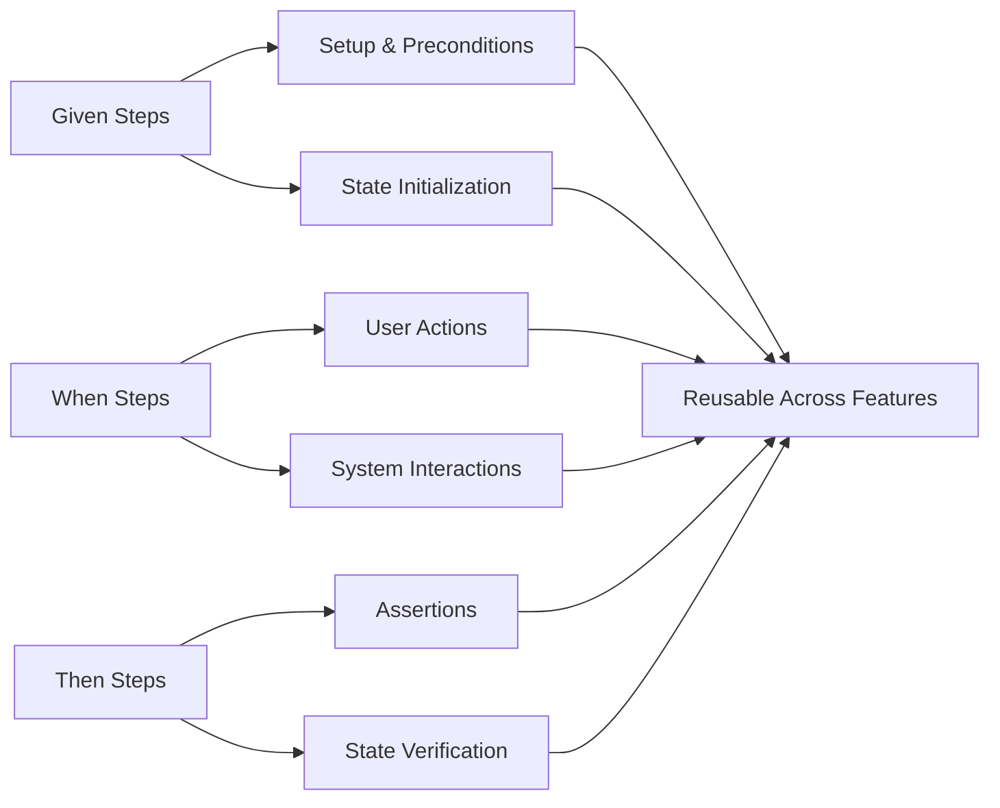

- **`01-given.steps.ts`** - Setup and precondition steps (210 lines)
- **`02-when.steps.ts`** - User action and interaction steps (360 lines)
- **`03-then.steps.ts`** - Assertion and verification steps (559 lines)

This approach **eliminated duplicate steps** and **promotes reusability** across different feature scenarios.

#### Key Step Patterns

```gherkin
# Generic element interactions
When I click on element with testid "button-id"
When I type "text" in element with testid "input-id"
Then element with testid "element-id" should be visible

# Keyboard shortcuts and UI actions
When I press "Escape"
When I press "Cmd+K"
When I open the command palette

# State verification
Then the keyboard shortcuts modal should be visible
Then vim mode should be toggled
Then the document-list should contain 2 documents
```

### Page Object Model Implementation

#### Architecture Benefits

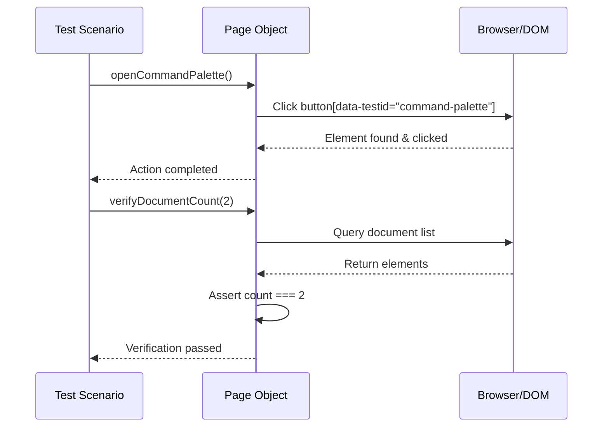

- **Centralized element selectors** using `data-testid` attributes
- **Reusable interaction methods** across multiple test scenarios
- **Maintainable test code** with separation of concerns
- **Type-safe operations** with TypeScript integration

#### Key Page Object Features

```typescript
// 1134 lines of comprehensive page interactions
export class MarkVimPage {
  // Element locators using data-testid pattern
  readonly commandPalette: Locator
  readonly editorContent: Locator
  readonly previewContent: Locator

  // High-level user actions
  async openCommandPalette(): Promise<void>
  async createNewDocument(): Promise<void>
  async verifyDocumentCount(expectedCount: number): Promise<void>
}
```

## Quality Assurance Process

### Automated Testing Pipeline

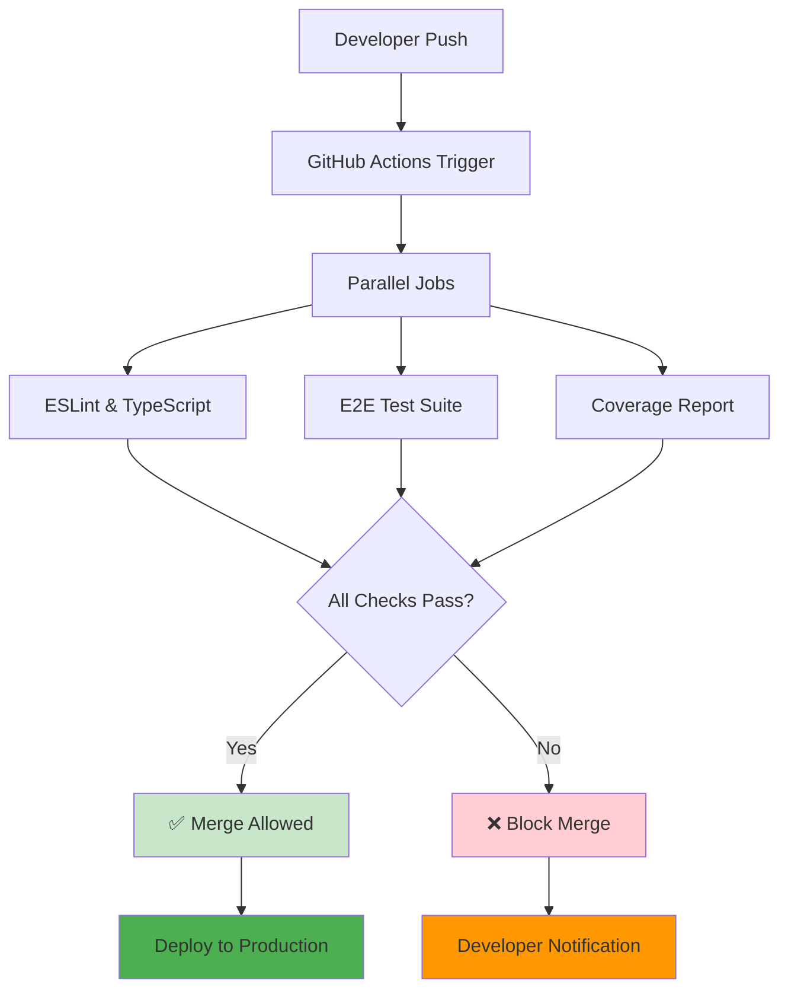

#### CI/CD Integration

Every code change triggers automated quality checks:

1. **ESLint Code Quality** - Style and syntax validation
2. **TypeScript Type Checking** - Static type verification
3. **End-to-End Test Suite** - Full user scenario validation

#### Performance Optimizations

```mermaid
gantt
    title E2E Test Execution Timeline
    dateFormat X
    axisFormat %s

    section Sequential (Old)
    All Tests : 0, 180

    section Parallel (Current)
    Test Group 1 : 0, 90
    Test Group 2 : 0, 90
```

- **Parallel test execution** (2 concurrent processes)
- **Playwright browser caching** for faster CI runs
- **Smart concurrency management** to prevent resource conflicts

### Testing Best Practices

#### Element Selection Strategy

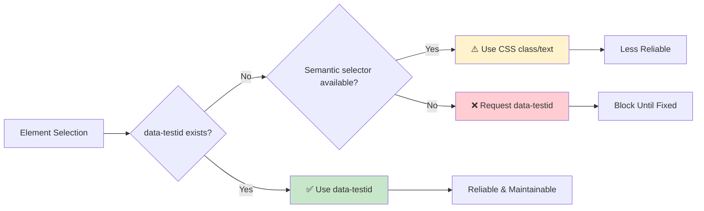

- **Always use `data-testid` attributes** for element selection
- **Semantic selectors** as fallbacks (CSS classes, text content)
- **Robust element waiting** with condition-based assertions

#### Test Reliability Patterns

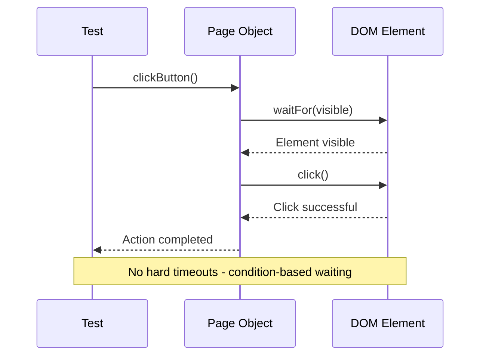

- **No hard timeouts** - use condition-based waiting instead
- **Proper element state verification** before interactions
- **Cleanup and isolation** between test scenarios

#### Code Quality Standards

- **Conventional commit messages** for automated change tracking
- **TypeScript strict mode** for type safety
- **ESLint configuration** following Antfu's standards
- **Husky pre-commit hooks** for quality gate enforcement

## Development Workflow

### Local Testing

```bash
# Start development server
pnpm dev

# Run E2E tests (headless)
pnpm run test:e2e

# Run E2E tests (with browser UI)
pnpm run test:e2e:headed

# Run tests with server auto-start
pnpm run test:e2e:with-server
```

### Test Development Process


1. **Write scenarios** in Gherkin syntax describing user behavior
2. **Implement step definitions** using existing patterns when possible
3. **Update page objects** for new UI elements and interactions
4. **Verify test reliability** across multiple runs
5. **Document new patterns** for team consistency

### Continuous Integration

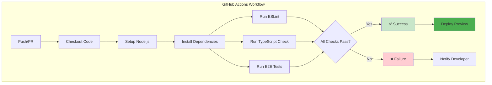

- **Automatic testing** on pushes to main/develop branches
- **Pull request validation** with full test suite execution
- **Test report artifacts** for debugging failed scenarios
- **Browser compatibility** testing with Chromium

## Test Coverage Philosophy

### Behavior-Driven Coverage

Rather than measuring code coverage, we focus on **behavior coverage**:

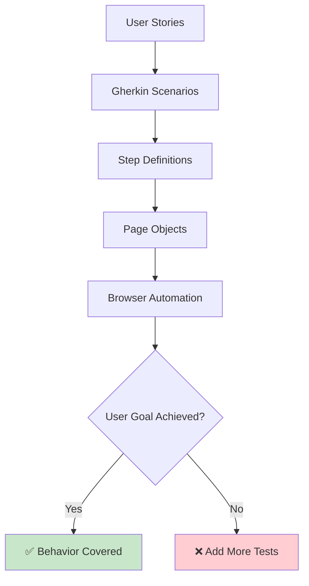

- **User journey completeness** - Can users accomplish their goals?
- **Feature interaction testing** - Do features work together correctly?
- **Error state handling** - Are edge cases properly managed?
- **Accessibility validation** - Is the application usable for everyone?

### Scenario Categorization

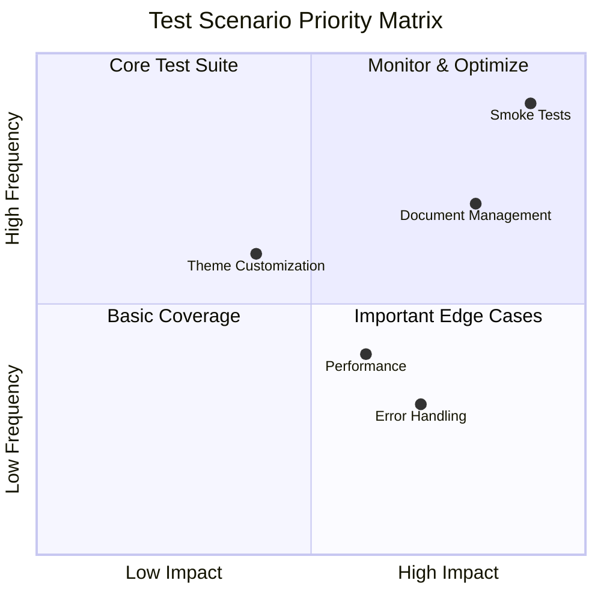

- **Smoke tests** - Core functionality verification
- **Feature tests** - Detailed user interaction flows
- **Integration tests** - Cross-feature behavior validation
- **Regression tests** - Previously identified issue prevention

## Quality Metrics & Monitoring

### Test Suite Health

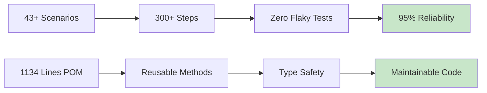

**Coverage Metrics**:
- **43+ scenarios** with **300+ steps** ensuring comprehensive coverage
- **100% step consolidation** eliminating duplicate test code
- **Page Object Model** with 1100+ lines of reusable interactions
- **Type-safe test implementations** preventing runtime errors

### Reliability Indicators

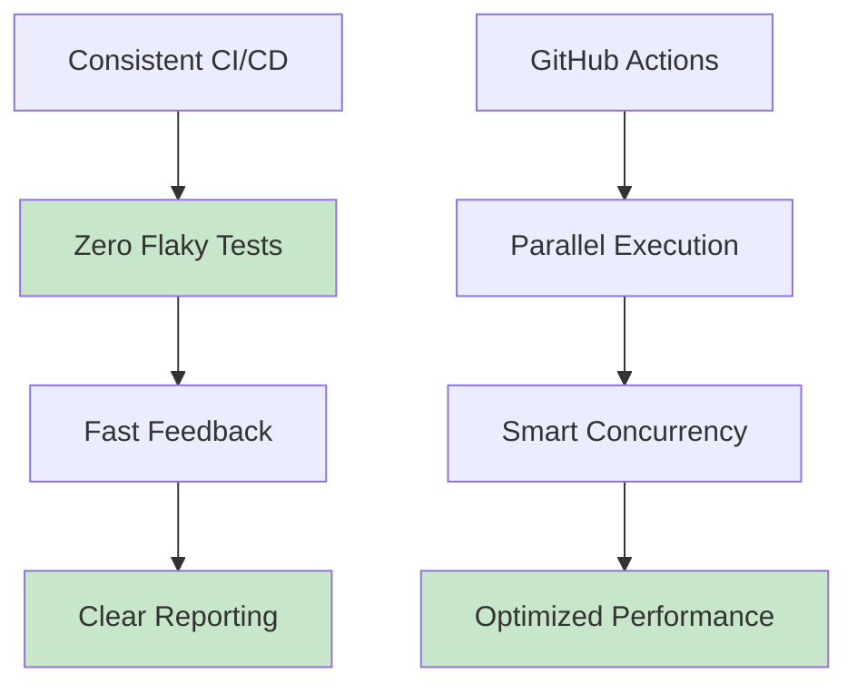

- **Consistent CI/CD execution** across all branches
- **Zero flaky tests** through proper async handling
- **Fast feedback loops** with optimized test execution
- **Clear failure reporting** with detailed error context

## Future Testing Enhancements

### Planned Improvements

```mermaid
roadmap
    title Testing Roadmap 2024-2025

    section Q1 2024
        Visual Regression Testing : done, 2024-01-01, 2024-03-31
        Performance Testing Setup : done, 2024-02-01, 2024-03-31

    section Q2 2024
        Cross-browser Expansion : active, 2024-04-01, 2024-06-30
        Component Unit Tests : active, 2024-05-01, 2024-06-30

    section Q3 2024
        AI-Powered Test Generation : planned, 2024-07-01, 2024-09-30
        Advanced Reporting : planned, 2024-08-01, 2024-09-30

    section Q4 2024
        Mobile Testing : planned, 2024-10-01, 2024-12-31
        Load Testing : planned, 2024-11-01, 2024-12-31
```

- **Visual regression testing** for UI consistency validation
- **Performance testing** with Lighthouse integration
- **Cross-browser testing** expansion beyond Chromium
- **Component-level testing** for isolated unit validation

### Scalability Considerations

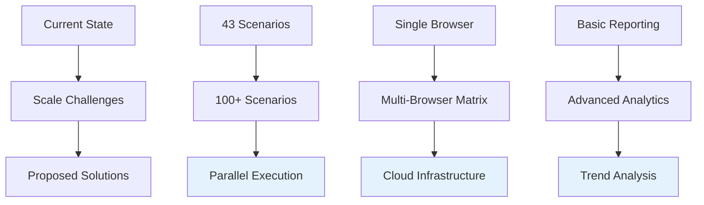

- **Test parallelization** strategies for larger test suites
- **Environment-specific configurations** for different deployment targets
- **Test data management** for complex scenarios
- **Advanced reporting** with trend analysis and metrics

---

This testing strategy ensures **reliable user experiences** through comprehensive automation while maintaining **developer productivity** with fast feedback cycles and maintainable test code.

## Contributing to Testing

### Adding New Tests

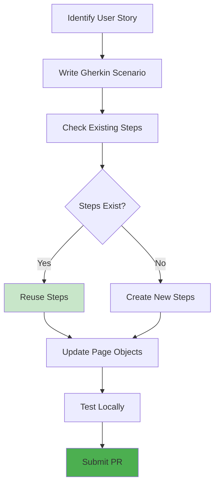

### Test Review Checklist

- [ ] Scenario uses clear, user-focused language
- [ ] Steps follow existing naming patterns
- [ ] Page objects updated with new elements
- [ ] Test passes locally in multiple runs
- [ ] No hard-coded waits or timeouts used
- [ ] Uses `data-testid` attributes for selection

### Getting Help

- **Slack**: #testing-strategy
- **Documentation**: `/tests/README.md`
- **Code Reviews**: Tag `@testing-team`
