# Event Communication Architecture

This document explains how MarkVim uses a typed event bus to enable decoupled communication between different modules.

## Overview

MarkVim implements a centralized event bus pattern that allows modules to communicate without direct dependencies on each other. This architecture provides:

- **Type safety**: All events are strongly typed using TypeScript interfaces
- **Decoupling**: Modules can interact without importing each other's implementation details
- **Clear contracts**: Events serve as the public API contract between modules
- **Centralized coordination**: All cross-module communication flows through a single event bus

## Core Architecture

### Event Bus Implementation

The event bus is implemented in `src/shared/utils/eventBus.ts` and provides three core functions:

```typescript
// Emit an event
emitAppEvent(eventKey, payload)

// Listen to an event (auto-unsubscribes on component unmount)
onAppEvent(eventKey, handler)

// Listen once to an event
onceAppEvent(eventKey, handler)
```

### Type System

The event bus aggregates events from all modules into a single typed interface:

```typescript
export interface AppEvents extends
  DocumentsEvents,
  EditorEvents,
  LayoutEvents,
  ShortcutsEvents,
  SharedEvents {}
```

Each module defines its own events in an `events.ts` file and exports them via their `api.ts` file. This ensures:

- Clear module ownership of events
- Visible cross-module dependencies
- Events as part of the module's public contract
- No circular dependencies

### Event Bus Architecture Diagram


## Module Event Definitions

### Documents Module Events

Located in `src/modules/documents/events.ts`:

```typescript
export interface DocumentsEvents {
  // Request document deletion (shows confirmation modal)
  'document:delete': {
    documentId: string
    documentTitle: string
  }

  // Confirm and execute document deletion
  'document:delete-confirmed': {
    documentId: string
  }

  // Select a document as active
  'document:select': {
    documentId: string
  }

  // Create a new document
  'document:create': undefined

  // Update document content
  'document:update': {
    documentId: string
    content: string
  }

  // Add document with content
  'documents:add': {
    content: string
  }

  // Import document with content
  'documents:import': {
    content: string
  }
}
```

### Editor Module Events

Located in `src/modules/editor/events.ts`:

```typescript
export interface EditorEvents {
  // Vim mode changed
  'vim-mode:change': {
    mode: string
    subMode?: string
  }

  // Insert text at cursor position
  'editor:insert-text': {
    text: string
  }

  // Editor content updated
  'editor:content-update': {
    documentId: string
    content: string
  }
}
```

### Layout Module Events

Located in `src/shared/layout/events.ts`:

```typescript
export interface LayoutEvents {
  // Switch view mode
  'view:set': {
    viewMode: 'editor' | 'split' | 'preview'
  }

  // Toggle sidebar visibility
  'sidebar:toggle': undefined
}
```

### Shortcuts Module Events

Located in `src/modules/shortcuts/events.ts`:

```typescript
export interface ShortcutsEvents {
  // Open command palette
  'command-palette:open': {
    position?: { x: number, y: number }
  }

  // Close command palette
  'command-palette:close': undefined
}
```

### Shared Events

Located in `src/shared/events.ts`:

```typescript
export interface SharedEvents {
  // Settings toggles
  'settings:toggle-vim': undefined
  'settings:toggle-line-numbers': undefined
  'settings:toggle-preview-sync': undefined
  'settings:save-document': undefined

  // Data management
  'data:reset': undefined
}
```

### Module Event Ownership

This diagram shows which modules own which events and what data they carry:


## Communication Patterns

### Pattern 1: Emitting Events

Modules emit events to notify other parts of the application about state changes or user actions:

**Example: Editor emits content update**
```typescript
// src/modules/editor/components/MarkdownEditor.vue:25
function handleContentUpdate(value: string) {
  emit('update:content', value)
  // Emit event for real-time synchronization
  emitAppEvent('editor:content-update', {
    documentId: 'current',
    content: value,
  })
}
```

**Example: Shortcuts module emits view mode change**
```typescript
// src/modules/shortcuts/components/ShortcutsManager.vue:89
{
  keys: '1',
  description: 'Switch to Editor only',
  action: () => emitAppEvent('view:set', { viewMode: 'editor' }),
  category: 'View',
}
```

### Pattern 2: Listening to Events

Modules listen to events to respond to actions from other modules:

**Example: Documents store listens for mutations**
```typescript
// src/modules/documents/store.ts:186-208
onAppEvent('document:create', () => {
  createDocument()
})

onAppEvent('document:select', (payload) => {
  setActiveDocument(payload.documentId)
})

onAppEvent('document:update', (payload) => {
  updateDocument(payload.documentId, payload.content)
})

onAppEvent('document:delete-confirmed', (payload) => {
  deleteDocument(payload.documentId)
})

onAppEvent('documents:add', (payload) => {
  addDocument(payload.content)
})

onAppEvent('documents:import', (payload) => {
  addDocument(payload.content)
})
```

**Example: Layout listens for view mode changes**
```typescript
// src/shared/layout/composables/useViewMode.ts:81-95
onAppEvent('view:set', (payload) => {
  setViewMode(payload.viewMode)
})

onAppEvent('sidebar:toggle', () => {
  toggleSidebar()
})

// Close sidebar on mobile when a document is selected
onAppEvent('document:select', () => {
  if (isMobile.value) {
    isSidebarVisible.value = false
  }
})
```

### Pattern 3: Command Palette Integration

The shortcuts module registers keyboard shortcuts that emit events:

```typescript
// src/modules/shortcuts/components/ShortcutsManager.vue:78-159
registerShortcuts([
  {
    keys: 'g t',
    description: 'Toggle sidebar',
    action: () => emitAppEvent('sidebar:toggle'),
    category: 'View',
  },
  {
    keys: '1',
    description: 'Switch to Editor only',
    action: () => emitAppEvent('view:set', { viewMode: 'editor' }),
    category: 'View',
  },
  {
    keys: 'v',
    description: 'Toggle Vim Mode',
    action: () => emitAppEvent('settings:toggle-vim'),
    category: 'Settings',
  },
  {
    keys: 'l',
    description: 'Toggle Line Numbers',
    action: () => emitAppEvent('settings:toggle-line-numbers'),
    category: 'Settings',
  },
])
```

## Real-World Communication Flows

### Flow 1: Creating a New Document

1. User presses keyboard shortcut (e.g., Cmd+N)
2. **ShortcutsManager** emits `document:create` event
3. **Documents store** listens to `document:create`, creates new document, and sets it as active
4. **Layout module** listens to `document:select` and closes sidebar on mobile


### Flow 2: Switching View Modes

1. User presses keyboard shortcut (e.g., "1" for editor-only view)
2. **ShortcutsManager** emits `view:set` event with `{ viewMode: 'editor' }`
3. **Layout module** listens to `view:set` and updates the view mode
4. View components reactively update based on new view mode


### Flow 3: Document Selection

1. User clicks on a document in the sidebar
2. **DocumentItem** component emits `document:select` event
3. **Documents store** listens to `document:select` and sets the active document
4. **Layout module** listens to `document:select` and closes sidebar on mobile
5. **Editor** reactively updates to show the newly selected document's content


### Flow 4: Command Palette Interaction

This shows bidirectional communication where the shortcuts module both emits and listens to its own events:


## Benefits of This Architecture

### 1. Decoupling
Modules don't need to know about each other's implementation:
- **Shortcuts module** can trigger document operations without importing the documents store
- **Layout module** can respond to document changes without depending on the documents module

### 2. Type Safety
TypeScript ensures type safety across all events:
```typescript
// ✅ Correct: Type-safe event emission
emitAppEvent('view:set', { viewMode: 'editor' })

// ❌ Error: TypeScript catches invalid payload
emitAppEvent('view:set', { viewMode: 'invalid' })

// ❌ Error: TypeScript catches missing payload
emitAppEvent('document:select', {})
```

### 3. Testability
Events can be easily mocked and tested in isolation:
```typescript
// Emit event in test
emitAppEvent('document:create')

// Assert side effects occurred
expect(store.documents).toHaveLength(2)
```

### 4. Clear Contracts
Events serve as the public API between modules:
- Easy to understand what events a module publishes and consumes
- Changes to event payloads are visible in the type system
- Documentation is embedded in the type definitions

## Best Practices

### 1. Define Events in Module's `events.ts`
```typescript
// src/modules/mymodule/events.ts
export interface MyModuleEvents {
  'mymodule:action': {
    data: string
  }
}
```

### 2. Export Events via Module's `api.ts`
```typescript
// src/modules/mymodule/api.ts
export type { MyModuleEvents } from './events'
```

### 3. Use Descriptive Event Names
- Prefix with module or domain: `document:`, `editor:`, `view:`
- Use action verbs: `create`, `update`, `delete`, `toggle`
- Be specific: `document:delete-confirmed` vs `document:delete`

### 4. Keep Payloads Minimal
Only include data that listeners actually need:
```typescript
// ✅ Good: Minimal payload
'document:select': {
  documentId: string
}

// ❌ Bad: Unnecessary data
'document:select': {
  documentId: string
  content: string      // Listener can fetch this if needed
  createdAt: number    // Listener can fetch this if needed
}
```

### 5. Use `undefined` for Events Without Payloads
```typescript
'document:create': undefined
'sidebar:toggle': undefined
```

### 6. Auto-cleanup with `onAppEvent`
The `onAppEvent` function automatically unsubscribes when the component/composable is unmounted, preventing memory leaks.

## Debugging Events

### View All Events
Check `src/shared/utils/eventBus.ts` to see the aggregated `AppEvents` interface.

### Add Event Logging
You can temporarily log events for debugging:
```typescript
onAppEvent('document:select', (payload) => {
  console.log('Document selected:', payload)
  // ... handle event
})
```

### Check Event Flow
Use browser DevTools to trace event emissions:
1. Set breakpoints in event handlers
2. Follow the call stack to see who emitted the event
3. Inspect payload data

## Complete Event Flow Ecosystem

This diagram shows all modules and their event interactions:

```mermaid
graph TB
    subgraph "User Interactions"
        U1[Keyboard Shortcuts]
        U2[Click Actions]
        U3[Menu Items]
    end

    subgraph "Event Bus"
        EB[Typed Event Bus<br/>emitAppEvent / onAppEvent]
    end

    subgraph "Modules"
        SM[Shortcuts Module<br/>---<br/>EMITS:<br/>- command-palette:*<br/>- view:set<br/>- sidebar:toggle<br/>- settings:*<br/>---<br/>LISTENS:<br/>- command-palette:*]

        DM[Documents Module<br/>---<br/>EMITS:<br/>- document:select<br/>- document:delete<br/>---<br/>LISTENS:<br/>- (none via events)<br/>- (uses TEA dispatch)]

        LM[Layout Module<br/>---<br/>LISTENS:<br/>- view:set<br/>- sidebar:toggle<br/>- document:select]

        EM[Editor Module<br/>---<br/>LISTENS:<br/>- settings:toggle-vim<br/>- settings:toggle-line-numbers]

        COMP[UI Components<br/>DocumentItem, etc.<br/>---<br/>EMITS:<br/>- document:select<br/>- document:delete]
    end

    subgraph "State Stores"
        DS[Documents Store<br/>Pinia + TEA]
        LS[Layout State<br/>useViewMode]
        ES[Editor Settings]
    end

    U1 --> SM
    U2 --> COMP
    U3 --> COMP

    SM -.->|emitAppEvent| EB
    COMP -.->|emitAppEvent| EB
    DM -.->|emitAppEvent| EB

    EB -.->|onAppEvent| SM
    EB -.->|onAppEvent| DM
    EB -.->|onAppEvent| LM
    EB -.->|onAppEvent| EM

    DM <--> DS
    LM <--> LS
    EM <--> ES

    style EB fill:#4a90e2,stroke:#2e5c8a,color:#fff,stroke-width:3px
    style SM fill:#fff3e0,stroke:#f57c00
    style DM fill:#e3f2fd,stroke:#1976d2
    style LM fill:#f3e5f5,stroke:#7b1fa2
    style EM fill:#e8f5e9,stroke:#388e3c
    style COMP fill:#ffebee,stroke:#c62828
    style DS fill:#e1f5fe,stroke:#0277bd
    style LS fill:#f1f8e9,stroke:#558b2f
    style ES fill:#fce4ec,stroke:#c2185b
```

## Current State vs Ideal State

### Current Reality (Mixed Pattern)

```mermaid
graph LR
    subgraph "Current Implementation"
        SM[Shortcuts Module]
        SHM[Share Module]
        DS[Documents Store]
        EB[Event Bus]

        SM -.->|❌ Direct dispatch| DS
        SHM -.->|❌ Direct dispatch| DS
        SM -.->|⚠️ Some events| EB

        style DS fill:#ffcccc,stroke:#cc0000
        style EB fill:#ccccff,stroke:#0000cc
    end
```



**Issues:**
- ❌ Many modules bypass event bus
- ❌ Direct store imports create coupling
- ❌ Incomplete event definitions
- ❌ Stores don't listen to events

### Ideal State (Event-Driven)

```mermaid
graph LR
    subgraph "Target Architecture"
        SM2[Shortcuts Module]
        SHM2[Share Module]
        EB2[Event Bus]
        DL[Event Listeners]
        DS2[Documents Store]

        SM2 -->|✅ Events only| EB2
        SHM2 -->|✅ Events only| EB2
        EB2 --> DL
        DL --> DS2

        style DS2 fill:#ccffcc,stroke:#00cc00
        style EB2 fill:#ccccff,stroke:#0000cc
        style DL fill:#ffffcc,stroke:#cccc00
    end
```



**Benefits:**
- ✅ Complete decoupling
- ✅ Clear event contracts
- ✅ Easy testing & mocking
- ✅ Independent modules

> 📖 **For detailed analysis and migration plan**, see [EVENT_DRIVEN_IMPROVEMENTS.md](./EVENT_DRIVEN_IMPROVEMENTS.md)

---

## Summary

The event bus architecture in MarkVim provides a clean, type-safe way for modules to communicate. Key points:

- **Centralized**: All events flow through a single typed event bus
- **Modular**: Each module defines and owns its events
- **Type-safe**: TypeScript ensures compile-time correctness
- **Decoupled**: Modules interact through events, not direct dependencies
- **Maintainable**: Clear contracts make the system easy to understand and modify
- **Bidirectional**: Modules can both emit and listen to events
- **Parallel Processing**: Multiple listeners can react to the same event independently

This pattern enables MarkVim's modular architecture while maintaining clean separation of concerns and type safety throughout the application.

### Current Challenges

While the architecture is well-designed, implementation shows:
- **Mixed patterns**: Some modules use events, others use direct store access
- **Incomplete events**: Missing definitions for common operations
- **Documentation gap**: Documented events that don't exist in code

See [EVENT_DRIVEN_IMPROVEMENTS.md](./EVENT_DRIVEN_IMPROVEMENTS.md) for detailed analysis and improvement roadmap.
