# Event-Driven Architecture: Analysis & Improvements

This document analyzes the current state of event-driven communication in MarkVim and proposes improvements to strengthen modular architecture through consistent event usage.

## Executive Summary

While MarkVim has a well-designed event bus architecture on paper, the actual implementation has **inconsistent adoption** of event-driven patterns. Many modules bypass the event bus and directly import/call stores, creating tight coupling that defeats the purpose of having an event bus.

### Key Findings

1. ❌ **Event Bus Underutilization**: ~40% of cross-module communication bypasses events
2. ❌ **Incomplete Event Definitions**: Missing critical events for document operations
3. ❌ **Mixed Communication Patterns**: Some use events, others use direct store imports
4. ❌ **Documentation vs Reality Gap**: Docs describe event-driven architecture that isn't fully implemented

---

## Issue 1: Inconsistent Event-Driven Communication

### Problem

The architecture documentation states that modules should communicate via events, but implementation shows direct store imports:

**❌ Current Implementation (Anti-pattern):**

```typescript
// src/modules/shortcuts/components/ShortcutsManager.vue:44-46
import { useDocumentsStore } from '~/modules/documents/api'

const documentsStore = useDocumentsStore()

function handleCreateDocument(): void {
  documentsStore.dispatch({ type: 'CREATE_DOCUMENT' })  // ❌ Direct coupling!
}
```

```typescript
// src/modules/share/components/ShareManager.vue:54
import { useDocumentsStore } from '~/modules/documents/api'

const documentsStore = useDocumentsStore()

function handleAutoImport(document: Document): void {
  documentsStore.dispatch({
    type: 'ADD_DOCUMENT',
    payload: { content: document.content }
  })  // ❌ Direct coupling!
}
```

```typescript
// src/modules/documents/composables/useDocumentDeletion.ts:24
documentsStore.dispatch({
  type: 'DELETE_DOCUMENT',
  payload: { documentId: documentToDelete.value.id }
})  // ❌ Even document composables bypass events
```

### Files with Direct Store Access

Found 12 files importing `useDocumentsStore`:
- ❌ `src/modules/shortcuts/components/ShortcutsManager.vue` (external module)
- ❌ `src/modules/share/components/ShareManager.vue` (external module)
- ✅ `src/modules/documents/components/DocumentList.client.vue` (same module - OK)
- ✅ `src/modules/documents/components/DocumentManagerAction.vue` (same module - OK)
- ❌ `src/modules/documents/composables/useDocumentDeletion.ts` (should use events)

### Impact

- **Tight Coupling**: Shortcuts module depends on Documents module implementation
- **Testing Difficulty**: Can't test ShortcutsManager without Documents store
- **Circular Dependencies Risk**: Modules can easily create dependency cycles
- **Inconsistent Patterns**: Developers don't know when to use events vs direct calls
- **Breaks Module Boundaries**: Violates the encapsulation principle

### Solution

**✅ Event-Driven Approach:**

```typescript
// ShortcutsManager.vue
import { emitAppEvent } from '@/shared/utils/eventBus'

function handleCreateDocument(): void {
  emitAppEvent('document:create')  // ✅ Decoupled!
}
```

```typescript
// ShareManager.vue
import { emitAppEvent } from '@/shared/utils/eventBus'

function handleAutoImport(document: Document): void {
  emitAppEvent('documents:import', { content: document.content })  // ✅ Decoupled!
}
```

```typescript
// Documents store - listens to events
import { onAppEvent } from '@/shared/utils/eventBus'

// In store setup
onAppEvent('document:create', () => {
  dispatch({ type: 'CREATE_DOCUMENT' })
})

onAppEvent('documents:import', (payload) => {
  dispatch({ type: 'ADD_DOCUMENT', payload })
})

onAppEvent('document:delete:confirmed', (payload) => {
  dispatch({ type: 'DELETE_DOCUMENT', payload })
})
```

---

## Issue 2: Incomplete Event Definitions

### Problem

Current event interfaces are incomplete and don't cover all cross-module operations:

**Documents Events (Missing 5+ critical events):**

```typescript
// src/modules/documents/events.ts
export interface DocumentsEvents {
  'document:delete': { documentId: string, documentTitle: string }
  'document:select': { documentId: string }

  // ❌ Missing events that ARE USED in code:
  // - document:create (used in ShortcutsManager)
  // - documents:import (used in ShareManager)
  // - documents:add (used in ShareManager)
  // - document:update (used in multiple places)
  // - document:delete:confirmed (mentioned in docs)
}
```

**Editor Events (Completely Empty):**

```typescript
// src/modules/editor/events.ts
export interface EditorEvents {
  // ❌ No events defined at all!
  // Missing: editor:content-update (mentioned in docs)
  // Missing: editor:insert-text (mentioned in docs)
  // Missing: vim-mode:change (mentioned in docs)
}
```

**Color Theme Events (File Doesn't Exist):**

```typescript
// ❌ No src/modules/color-theme/events.ts file
// Missing: theme:update
// Missing: theme:reset
// Missing: theme:import
```

### Documentation vs Reality

The `docs/EVENT_COMMUNICATION.md` documents these events, but they don't exist in code:

```typescript
// Documented but not implemented:
'editor:content-update': { documentId: string, content: string }
'vim-mode:change': { mode: string, subMode?: string }
'editor:insert-text': { text: string }
```

### Impact

- **Incomplete Contracts**: Event bus doesn't expose all operations
- **Forces Direct Coupling**: Missing events force developers to import stores directly
- **Documentation Mismatch**: Docs reference events that don't exist in implementation
- **New Developer Confusion**: Inconsistent patterns make it unclear what to use

### Solution

**✅ Complete Event Definitions:**

```typescript
// src/modules/documents/events.ts
export interface DocumentsEvents {
  // Lifecycle
  'document:create': undefined
  'document:created': { documentId: string }

  // Selection
  'document:select': { documentId: string }
  'document:selected': { documentId: string }

  // Updates
  'document:update': { documentId: string, content: string }
  'document:updated': { documentId: string }

  // Deletion (two-phase: request → confirm)
  'document:delete': { documentId: string, documentTitle: string }
  'document:delete:confirmed': { documentId: string }
  'document:deleted': { documentId: string }

  // Import/Add
  'documents:import': { content: string }
  'documents:add': { content: string }
}
```

```typescript
// src/modules/editor/events.ts
export interface EditorEvents {
  // Content changes
  'editor:content-update': {
    documentId: string
    content: string
  }

  // Text insertion
  'editor:insert-text': {
    text: string
  }

  // Vim mode changes
  'vim-mode:change': {
    mode: string
    subMode?: string
  }
}
```

```typescript
// src/modules/color-theme/events.ts (NEW FILE)
export interface ColorThemeEvents {
  // Theme updates
  'theme:update': {
    colorKey: keyof ColorTheme
    color: OklchColor
  }
  'theme:updated': {
    theme: ColorTheme
  }

  // Theme reset
  'theme:reset': undefined
  'theme:reset:complete': {
    theme: ColorTheme
  }

  // Theme import
  'theme:import': {
    theme: ColorTheme
  }
  'theme:imported': {
    theme: ColorTheme
  }
}
```

---

## Issue 3: Stores Don't Listen to Events

### Problem

Documents store (and others) use TEA (The Elm Architecture) pattern with `dispatch()`, but they **don't listen to any events**. Everything is direct dispatch from external modules.

**Current Reality:**

```typescript
// Documents store does NOT have any event listeners
// Other modules call dispatch directly:
documentsStore.dispatch({ type: 'CREATE_DOCUMENT' })
```

**Documentation Claims:**

```typescript
// docs/EVENT_COMMUNICATION.md says store listens:
"Documents store listens to document:create, creates new document..."
```

This is **not implemented**.

### Impact

- **Event Bus is Decoration**: It exists but isn't used for cross-module communication
- **Documentation Misleading**: Docs describe a pattern that doesn't exist
- **No Decoupling**: Direct dispatch creates same coupling as direct method calls

### Solution

**✅ Add Event Listeners to Stores:**

```typescript
// src/modules/documents/store.ts
export const useDocumentsStore = defineStore('documents', () => {
  // ... existing code ...

  // EVENT LISTENERS (NEW)
  onAppEvent('document:create', () => {
    dispatch({ type: 'CREATE_DOCUMENT' })
  })

  onAppEvent('document:select', (payload) => {
    dispatch({ type: 'SELECT_DOCUMENT', payload })
  })

  onAppEvent('document:update', (payload) => {
    dispatch({ type: 'UPDATE_DOCUMENT', payload })
  })

  onAppEvent('document:delete:confirmed', (payload) => {
    dispatch({ type: 'DELETE_DOCUMENT', payload })
  })

  onAppEvent('documents:import', (payload) => {
    dispatch({ type: 'ADD_DOCUMENT', payload: { content: payload.content } })
  })

  return {
    // ... existing exports ...
    // Keep dispatch for internal module use
    dispatch,
  }
})
```

**Benefits:**
- External modules use events: `emitAppEvent('document:create')`
- Internal module components can still use dispatch if needed
- Dual interface during migration

---

## Issue 4: Module Store Exports in API

### Problem

Stores are exported in module APIs, encouraging direct access:

```typescript
// src/modules/documents/api.ts
export { useDocumentsStore } from './store'  // ❌ Exposes internal state management

// src/modules/color-theme/api.ts
export { useColorThemeStore } from './store'  // ❌ Exposes internal state management
```

This **invites** developers to bypass events:

```typescript
// Easy but wrong:
import { useDocumentsStore } from '~/modules/documents/api'
const store = useDocumentsStore()
store.dispatch({ ... })  // ❌ Direct coupling
```

### Solution Options

#### Option A: Remove Store Exports (Strict Event-Driven)

```typescript
// src/modules/documents/api.ts
// ❌ Remove this:
// export { useDocumentsStore } from './store'

// ✅ Only export public contracts:
export type { DocumentsEvents } from './events'
export type { Document } from '~/modules/domain/api'
export { getDocumentTitle } from './utils'

// Force all communication via events
```

**Pros:**
- ✅ Strictest decoupling
- ✅ Forces event-driven patterns
- ✅ Clearest module boundaries
- ✅ Impossible to violate (compile error)

**Cons:**
- ⚠️ Requires all consumers to migrate first
- ⚠️ May be overkill for tightly related components
- ⚠️ Breaking change

#### Option B: Document Store Access Guidelines (Pragmatic)

Keep stores exported but add clear guidelines:

```typescript
// src/modules/documents/api.ts
/**
 * Documents Store
 *
 * ⚠️ USAGE GUIDELINES:
 * - Only import from WITHIN the documents module
 * - External modules MUST use events to communicate
 * - Exception: Read-only access from display components (use storeToRefs)
 *
 * Examples:
 * ✅ From within documents module: const store = useDocumentsStore()
 * ❌ From shortcuts module: useDocumentsStore() - use emitAppEvent instead
 */
export { useDocumentsStore } from './store'
```

**Pros:**
- ✅ More flexible
- ✅ Allows optimizations
- ✅ Gradual migration path
- ✅ Can co-exist with events

**Cons:**
- ⚠️ Requires discipline
- ⚠️ Easy to violate
- ⚠️ Needs linting enforcement

**Recommendation:** Start with **Option B**, migrate to **Option A** in v2.0

---

## Issue 5: Event Naming Inconsistency

### Problem

Inconsistent event naming patterns:

```typescript
// Mixed singular/plural
'document:delete'      // singular noun
'documents:import'     // plural noun
'documents:add'        // plural noun

// Missing domain context
'view:set'             // what's being set?
'sidebar:toggle'       // OK but could be clearer

// Inconsistent qualifiers
'document:delete'              // request to delete
'document:delete-confirmed'    // uses hyphen (from docs)
'document:delete:confirmed'    // uses colon (better)
```

### Solution

**✅ Standardized Naming Convention:**

```
Pattern: <resource>:<action>[:<qualifier>]

Resources (singular): document, editor, theme, view, sidebar
Actions: create, update, delete, select, toggle, open, close, set
Qualifiers: confirmed, complete, failed, requested

Examples:
✅ document:create
✅ document:update
✅ document:delete:confirmed
✅ editor:content:update
✅ theme:import:complete
✅ view:mode:set
✅ sidebar:visibility:toggle
```

**Migration:**
```typescript
// Old → New
'documents:import' → 'document:import'
'documents:add' → 'document:add'
'view:set' → 'view:mode:set'
'sidebar:toggle' → 'sidebar:visibility:toggle'
```

---

## Implementation Roadmap

### Phase 1: Complete Event Definitions ✅ (Low Risk)

**Tasks:**
1. Add missing events to `documents/events.ts`
2. Implement `editor/events.ts` with actual events
3. Create `color-theme/events.ts`
4. Update event bus aggregation
5. Export events from module APIs

**Files to Modify:**
- `src/modules/documents/events.ts`
- `src/modules/editor/events.ts`
- `src/modules/color-theme/events.ts` (new)
- `src/shared/utils/eventBus.ts`

**Effort:** 2-4 hours
**Risk:** Low (additive only, no breaking changes)
**Testing:** Type checking

---

### Phase 2: Add Event Listeners to Stores (Medium Risk)

**Tasks:**
1. Add event listeners to documents store
2. Add event listeners to color-theme store
3. Keep dispatch methods for backward compatibility
4. Test both event and dispatch paths work
5. Document dual interface

**Files to Modify:**
- `src/modules/documents/store.ts`
- `src/modules/color-theme/store.ts`

**Effort:** 4-6 hours
**Risk:** Medium (changes store behavior)
**Testing:** Unit tests + E2E tests

---

### Phase 3: Migrate External Callers (Medium Risk)

**Tasks:**
1. Update ShortcutsManager to emit events
2. Update ShareManager to emit events
3. Update useDocumentDeletion composable
4. Remove direct store imports from external modules
5. Add ESLint rule to prevent future violations

**Files to Modify:**
- `src/modules/shortcuts/components/ShortcutsManager.vue`
- `src/modules/share/components/ShareManager.vue`
- `src/modules/documents/composables/useDocumentDeletion.ts`
- ESLint config

**Effort:** 6-8 hours
**Risk:** Medium (broad changes across modules)
**Testing:** E2E test suite

---

### Phase 4: Enforce Policies (Low Risk)

**Tasks:**
1. Decide on Option A (strict) vs Option B (pragmatic) for store exports
2. Document policy in `CLAUDE.md`
3. Add ESLint rules if choosing Option A
4. Update architecture documentation
5. Add migration guide for future developers

**Files to Modify:**
- `CLAUDE.md`
- `docs/EVENT_DRIVEN_IMPROVEMENTS.md` (this file)
- `docs/EVENT_COMMUNICATION.md`
- ESLint config

**Effort:** 2-3 hours
**Risk:** Low (documentation mostly)
**Testing:** Lint checks

---

## Proposed ESLint Rules

### Rule 1: No Cross-Module Store Imports

```javascript
// eslint-rules/no-cross-module-stores.js
module.exports = {
  meta: {
    type: 'problem',
    docs: {
      description: 'Prevent importing stores from other modules. Use events instead.',
      category: 'Architecture',
    },
  },
  create(context) {
    return {
      ImportDeclaration(node) {
        const source = node.source.value
        const currentFile = context.getFilename()

        // Extract current module from file path
        const moduleMatch = currentFile.match(/\/modules\/([^/]+)\//)
        const currentModule = moduleMatch ? moduleMatch[1] : null

        // Check if importing store from different module
        const storeMatch = source.match(/\/modules\/([^/]+)\/api/)
        if (storeMatch && currentModule && storeMatch[1] !== currentModule) {
          const importedModule = storeMatch[1]

          // Check if importing a store composable
          const importNames = node.specifiers
            .filter(spec => spec.type === 'ImportSpecifier')
            .map(spec => spec.imported.name)

          const storeImports = importNames.filter(name => name.includes('Store'))

          if (storeImports.length > 0) {
            context.report({
              node,
              message: `Do not import stores from other modules. Found: ${storeImports.join(', ')} from ${importedModule}. Use events instead: emitAppEvent('${importedModule}:action', payload)`,
            })
          }
        }
      },
    }
  },
}
```

### Rule 2: Validate Event Names

```javascript
// eslint-rules/validate-event-names.js
// Ensures emitAppEvent calls use events defined in AppEvents interface
// And enforces naming convention: <resource>:<action>[:<qualifier>]
```

---

## Benefits After Implementation

### Developer Experience ✨

- **Clear Patterns**: Developers know exactly when to use events vs direct access
- **Better Testing**: Mock events instead of complex store mocks
- **Self-Documenting**: Event definitions serve as clear API contracts
- **Consistent**: Same pattern across entire codebase

### Maintainability 🔧

- **Loose Coupling**: Modules are truly independent
- **Safe Refactoring**: Change store internals without breaking consumers
- **Parallel Development**: Multiple teams can work on different modules safely
- **Easy Debugging**: Event flow is traceable in DevTools

### Performance 🚀

- **Optimized Listeners**: Event bus can batch updates
- **Lazy Loading**: Modules load only when their events are needed
- **Memory Efficiency**: Automatic cleanup via `onAppEvent`
- **No Re-renders**: Events don't trigger unnecessary Vue reactivity

---

## Diagrams

### Current Architecture (Mixed Pattern)

```mermaid
graph TB
    SM[Shortcuts Module]
    SHM[Share Module]
    DS[Documents Store]
    EB[Event Bus]

    SM -.->|❌ Direct Import| DS
    SHM -.->|❌ Direct Import| DS
    SM -->|✅ Some Events| EB

    style DS fill:#ff9999
    style EB fill:#99ccff
```



### Proposed Architecture (Event-Driven)

```mermaid
graph TB
    SM[Shortcuts Module]
    SHM[Share Module]
    DL[Documents Listeners]
    DS[Documents Store]
    EB[Event Bus]

    SM -->|✅ Events Only| EB
    SHM -->|✅ Events Only| EB
    EB --> DL
    DL --> DS

    style DS fill:#99ff99
    style EB fill:#99ccff
    style DL fill:#ffcc99
```



---

## Decision Points

### Decision 1: Store Export Policy

**Vote Required:**

- [ ] **Option A**: Remove all store exports (strict, breaking change)
- [x] **Option B**: Keep exports with documented guidelines (pragmatic, recommended)

**Recommendation:** Start with **Option B** for gradual migration

---

### Decision 2: Event Granularity

**Vote Required:**

- [x] **Option A**: Many specific events (better type safety, easier debugging)
- [ ] **Option B**: Fewer general events (less boilerplate, more flexible)

**Recommendation:** **Option A** - More events provide better contracts

---

### Decision 3: Migration Timeline

**Vote Required:**

- [ ] **Option A**: Big bang migration (risky, fast, 2 days)
- [x] **Option B**: Gradual phase-by-phase (safe, slower, 2 weeks)

**Recommendation:** **Option B** - Reduce risk with incremental approach

---

## Examples: Before & After

### Example 1: Creating a Document

**❌ Before (Direct Coupling):**

```vue
<script setup lang="ts">
import { useDocumentsStore } from '~/modules/documents/api'

const documentsStore = useDocumentsStore()

function handleCreateDocument(): void {
  // ❌ Shortcuts module knows about Documents store internals
  documentsStore.dispatch({ type: 'CREATE_DOCUMENT' })
}
</script>
```

**✅ After (Event-Driven):**

```vue
<script setup lang="ts">
import { emitAppEvent } from '@/shared/utils/eventBus'

function handleCreateDocument(): void {
  // ✅ Shortcuts module only knows the public event contract
  emitAppEvent('document:create')
}
</script>
```

**In Documents Store:**

```typescript
// Documents store listens and handles internally
onAppEvent('document:create', () => {
  dispatch({ type: 'CREATE_DOCUMENT' })
  emitAppEvent('document:created', { documentId: newDoc.id })
})
```

---

### Example 2: Deleting a Document

**❌ Before (Direct Dispatch):**

```typescript
// useDocumentDeletion composable
function confirmDeleteDocument(): void {
  if (documentToDelete.value) {
    // ❌ Composable directly manipulates store
    documentsStore.dispatch({
      type: 'DELETE_DOCUMENT',
      payload: { documentId: documentToDelete.value.id }
    })
  }
}
```

**✅ After (Event Chain):**

```typescript
// useDocumentDeletion composable
function confirmDeleteDocument(): void {
  if (documentToDelete.value) {
    // ✅ Emit confirmation event
    emitAppEvent('document:delete:confirmed', {
      documentId: documentToDelete.value.id
    })
  }
}

// In Documents Store
onAppEvent('document:delete:confirmed', (payload) => {
  dispatch({ type: 'DELETE_DOCUMENT', payload })
  emitAppEvent('document:deleted', { documentId: payload.documentId })
})
```

---

## Conclusion

The current architecture has a **solid foundation** (typed event bus, clear module boundaries) but suffers from **inconsistent execution** (direct store access, incomplete events, mixed patterns).

### Current State: 🟡 Mixed

- ✅ Event bus infrastructure exists
- ✅ Some events defined
- ✅ Some modules use events
- ❌ Many modules bypass events
- ❌ Stores don't listen to events
- ❌ Incomplete event definitions

### Target State: 🟢 Event-Driven

- ✅ Complete event definitions
- ✅ Stores listen to events
- ✅ External modules use events exclusively
- ✅ Clear documented policies
- ✅ ESLint enforcement

### Recommendation

**Implement the 4-phase roadmap:**

1. Complete event definitions (2-4 hours)
2. Add store event listeners (4-6 hours)
3. Migrate external callers (6-8 hours)
4. Enforce with docs & linting (2-3 hours)

**Total Investment:** ~16-20 hours
**Risk Level:** Medium
**Value:** High (foundation for scalable architecture)

This investment will pay dividends as the codebase grows and more developers contribute. A truly event-driven architecture enables:

- Independent module development
- Easy testing and mocking
- Clear API contracts
- Safe refactoring
- Parallel team workflows

**Next Step:** Get team consensus on decisions, then start Phase 1.
